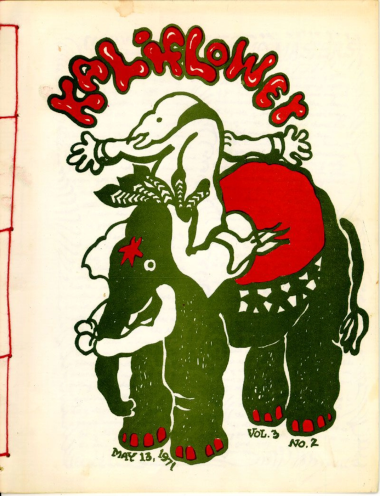
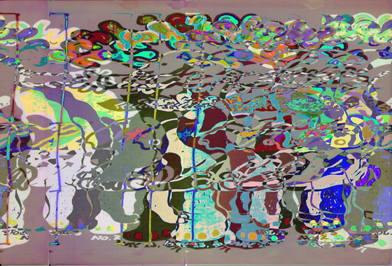

# audimage
Apply audio effects (reverb, delay) to images and video for a unique distortion effect; see the before and after images below!




---

### How To Use

1. Clone the repository into your desired directory:
   ```git clone git@github.com:datmaxo/audimage.git```

2. Execute the `reverbgui.py` script, either manually or in a CLI via `python3 reverbgui.py`
   (Execution is currently dependent on PIL being installed; dependencies will be sorted out in the future)

3. Alter the parameters of the reverb script as you please, and play around with the effect!

---
